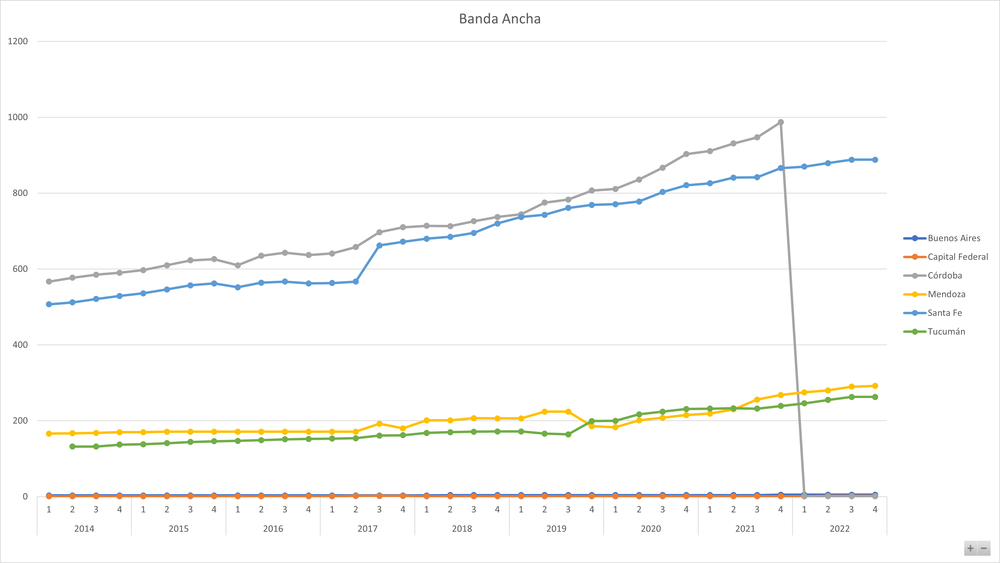
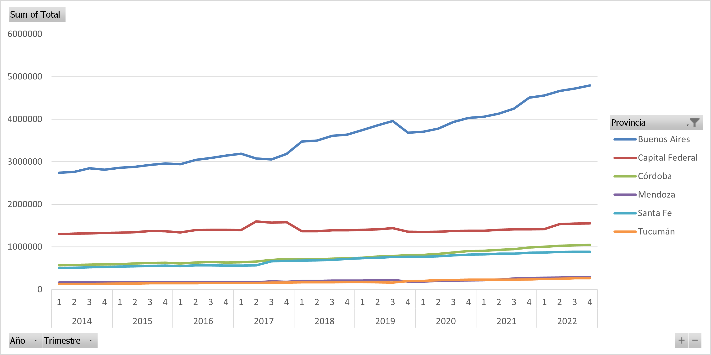
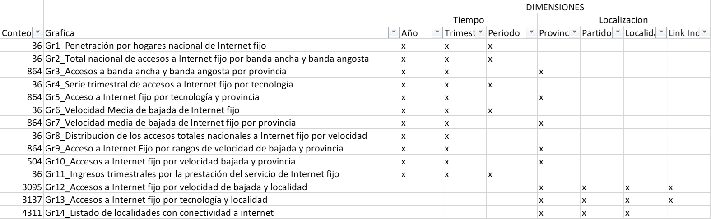
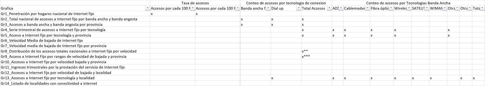

# HRY_PT04_PI02
En este proyecto se explora un set de datos abiertos relativos a servicios de telecomunicaciones en Argentina.

**Introduction**

El objetivo de este proyecto es poner a prueba las skills de analisis de datos aplicando estos conocimientos en la exploracion de set de datos publicos disponibles en el portal de ENACOM (Argentina)
+ 1-En primer lugar se llevara a cabo la descarga de la inforamcion, la cual  disponible en formato Excel o en CSV
+ 2-Una vez decargada la inforamcion se realizara una clasificacion preliminar de las variables contenidas en los dataset (Dimensiones y Metricas)
+ 3-Luego de esto se propondra un esquema de Analisis de calidad de datos y su correspondiente estructura grafica(para esto enriquesemos el set de datos con otrop dataset de origen publico)
+ 4-A continuacion se presentarán alternativas para la imputacion de datos alejados del rango
+ 5-En seguida se explorará el comportamiento de algunas variables de interes 
+ 6-Basado en el punto anterior se formulará un KPI y su correspondiente estrategia enfocado en el mejoramiento del servicio brindado
+ 7-A continuación se formulará el KPI "presupuestado" con relacion al aumento de accesos a internet por provincia
+ 7-Finalmente se presentarán las conclusiones finales

**1-Descarga de la información**

Lo primero que hay que observar en la descarga de la informacion es que está disponible en 2 formatos: Excel y CSV. Para responder la pregunta sobre si los dataset son iguales basta con observar la diferencia entre la tendencia que se puede observar por provincia para los datos de la quinta grafica en sus dos versiones. 
Para generar esta primera grafica se uso la version CSV filtrando por algunas provincias de interes

La fuente de esta segunda grafica es la version Excel del archivo disponibles desde el menu de "Informacion" de la grafica correspondiente

La diferencia en la tendencia por dar un ejemplo de Buenos Aires, es evidente. De otro lado la que resulta teniendo sentido es la version Excel pues en la version CSV se ve una caida de los accesos en Buenos Aires a cero para el año 2022. Por este motivo y otros casos observados que no se comentarán aqui se ha decicido contar únicamente con las versiones Excel

**2-Clasificacion Preliminar de las variables**
La variables de cada uno de los set de datos en general se pueden clasificar en dos grandes grupos: las dimensiones y las metricas. 
Las primeras son variables categoricas como las relativas al tiempo y la ubicacion. En las de tiempo se incluyen el año, el trimestre y el periodo, que puede entender como una variable calculada a partir de las dos previas. Dentro de las de ubicacion se encuentran: la provicia, el partido y la localidad. 
Vemos aqui la aparicion de cada Dimension en los respectivos datasets:

Las metricas por su parte dan, como es sugerido, una medida respecto de algo. En este caso se habla de cantidad o tasas de accesos, rangos de velocidad de internet o velocidades puntuales o promedio y finalmente de ingresos.
En la imagen a continuación se ve la clasificacion de algunas de las metricas y su aparición en los respectivos datasets

[El excel completo con las metricas se puede encontrar aqui] (/Validaciones2.xlsx)

**3-Esquema de análisis de calidad de datos**
Entendiendo que cada tupla combinacion_de_variables-metrica genera una linea de tendencia , para este analisis se ha propuesto analizar la suavidad de esa linea de tendencia y asociarle un indice o calificacion correspondiente: el indice de calidad sera mayor entre mas suave sea la curva. Para el caso de la grafica de tendencia que se obtuvo para Conteo de Accesos en Buenos Aires por ejemplo tendria que dar muy mal en el caso del los datos obtenidos desde el CSV y mucho mejor en los datos obtenidos desde el Excel.

El esquema que se propone en concreo se trata de calificar cada combinacion de dimension de Ubicacion por cada metrica para luego generar un totalizado teiendo en cuenta tambien la congruencia de los valores por provincia y los totales nacionales. 
 
En la tabla a continuacion se ve la propuesta preliminar

**7-Conclusiones**

